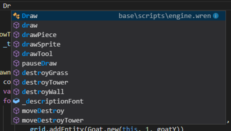
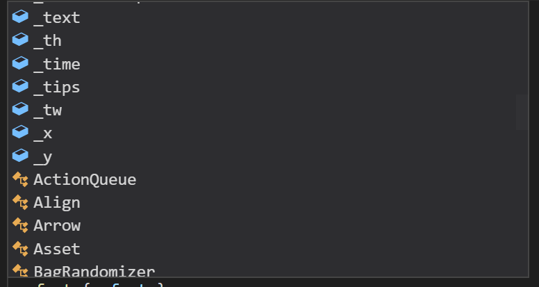
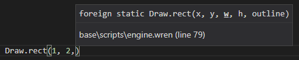
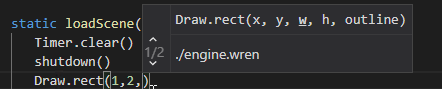

# Wren Language Provider for Visual Studio Code

This is a super basic VS Code extension that provides some autocompletion and function signature helpers for the [Wren](http://wren.io) scripting language. So far, this extension is more of a fun learning experience, and something that I could personally use to help remember function signatures. I'd love if someone else became inspired by this to improve it though! I've never written tools to deal with languages and ASTs, and it probably shows. On the upside, there's not a ton of code outside of the ported Wrenalyzer!

## Features

- Parses the current file and all imports in that file into ASTs through a TypeScript port of Wrenalyzer.
- Provides autocompletion for class names, static methods, class methods, static fields, fields, and some variables on a per-file basis.
- Basic autocomplete filtering based on whether static/instance methods, fields, class names are appropriate.
- Provides function signature completion based on function name in current file and all imports.
- Probably doesn't do all that great of a job.

## Screenshots

## Requirements

This extension doesn't provide any syntax formatting, so grab one of the other Wren extensions available on the Extension Marketplace.

## Extension Settings

This extension contributes the following settings:

* `wren.additionalModuleDirectories`: an array of relative paths to scan in addition to the script directory.